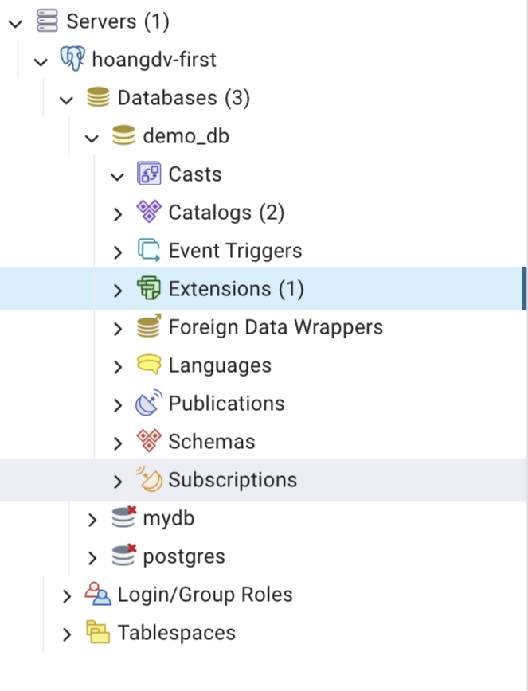

# Giải thích cấu trúc Database trong pgAdmin

Khi kết nối vào PostgreSQL qua pgAdmin, bạn sẽ thấy cấu trúc như sau:



> **Lưu ý**: Thêm screenshot pgAdmin của bạn vào folder này với tên `pgadmin-structure.png`

## 📊 Server: hoangdy-first
Server là kết nối đến PostgreSQL database instance.

---

## 🗄️ Databases (3)
Danh sách các database trong server. Ở đây có 3 databases:
- **demo_db**: Database được tạo cho user demo (từ init script)
- **mydb**: Database mặc định được tạo từ docker-compose
- **postgres**: Database mặc định của PostgreSQL (luôn tồn tại)

---

### Các thành phần bên trong Database (demo_db)

#### 🎭 Casts
**Type Casting** - Chuyển đổi kiểu dữ liệu.

- **Mục đích**: Định nghĩa cách PostgreSQL chuyển đổi từ kiểu dữ liệu này sang kiểu khác
- **Ví dụ**: Chuyển `VARCHAR` sang `INTEGER`, hoặc `TEXT` sang `DATE`
- **Sử dụng**: 
  ```sql
  -- Tự động cast string sang integer
  SELECT '123'::INTEGER;
  ```

---

#### 📚 Catalogs (2)
**System Catalogs** - Bảng hệ thống lưu metadata.

- **Mục đích**: Lưu trữ thông tin về cấu trúc database (metadata)
- **Nội dung**: Thông tin về tables, columns, indexes, users, permissions, etc.
- **Ví dụ catalogs**:
  - `pg_catalog`: Schema chứa các system tables
  - `information_schema`: Views chuẩn SQL để truy vấn metadata
- **Sử dụng**:
  ```sql
  -- Xem danh sách tất cả tables
  SELECT * FROM information_schema.tables;
  
  -- Xem thông tin columns
  SELECT * FROM information_schema.columns 
  WHERE table_name = 'employees';
  ```

---

#### ⚡ Event Triggers
**Triggers kích hoạt bởi sự kiện DDL**.

- **Mục đích**: Tự động thực thi function khi có thay đổi cấu trúc database
- **Khác với Trigger thường**: 
  - Trigger thường: Kích hoạt khi INSERT/UPDATE/DELETE data
  - Event Trigger: Kích hoạt khi CREATE/ALTER/DROP table/function
- **Sử dụng**: Audit, logging, prevent DROP operations
- **Ví dụ**:
  ```sql
  -- Ngăn không cho xóa table
  CREATE OR REPLACE FUNCTION prevent_drop()
  RETURNS event_trigger AS $$
  BEGIN
    RAISE EXCEPTION 'Dropping tables is not allowed!';
  END;
  $$ LANGUAGE plpgsql;

  CREATE EVENT TRIGGER block_drop_table
  ON ddl_command_start
  WHEN TAG IN ('DROP TABLE')
  EXECUTE FUNCTION prevent_drop();
  ```

---

#### 🔌 Extensions (1)
**Mở rộng tính năng của PostgreSQL**.

- **Mục đích**: Thêm chức năng bổ sung vào PostgreSQL
- **Extensions phổ biến**:
  - `plpgsql`: Ngôn ngữ procedural (đã cài mặc định)
  - `uuid-ossp`: Tạo UUID
  - `postgis`: Xử lý dữ liệu địa lý (GIS)
  - `pg_trgm`: Tìm kiếm fuzzy/similarity
  - `pgcrypto`: Mã hóa dữ liệu
- **Sử dụng**:
  ```sql
  -- Cài extension
  CREATE EXTENSION IF NOT EXISTS "uuid-ossp";
  
  -- Sử dụng
  SELECT uuid_generate_v4();
  ```

---

#### 🌍 Foreign Data Wrappers
**Kết nối đến database/data source khác**.

- **Mục đích**: Truy vấn dữ liệu từ database khác như thể là local tables
- **Hỗ trợ**: MySQL, Oracle, MongoDB, CSV files, REST APIs, etc.
- **Sử dụng**: Data integration, federation
- **Ví dụ**:
  ```sql
  -- Tạo FDW cho MySQL
  CREATE EXTENSION mysql_fdw;
  
  CREATE SERVER mysql_server
  FOREIGN DATA WRAPPER mysql_fdw
  OPTIONS (host '192.168.1.100', port '3306');
  
  -- Tạo foreign table
  CREATE FOREIGN TABLE remote_users (
    id INT,
    name VARCHAR(100)
  ) SERVER mysql_server
  OPTIONS (dbname 'mydb', table_name 'users');
  
  -- Query như table bình thường
  SELECT * FROM remote_users;
  ```

---

#### 🗣️ Languages
**Ngôn ngữ lập trình để viết stored procedures/functions**.

- **Mục đích**: Định nghĩa ngôn ngữ có thể dùng để viết functions
- **Languages mặc định**:
  - `SQL`: Ngôn ngữ SQL thuần
  - `plpgsql`: Procedural language (có IF, LOOP, etc.)
  - `C`: Viết function bằng C (hiệu suất cao)
- **Languages bổ sung**: Python (plpython), Perl (plperl), JavaScript (plv8)
- **Ví dụ**:
  ```sql
  -- Function bằng plpgsql
  CREATE FUNCTION calculate_bonus(salary NUMERIC)
  RETURNS NUMERIC AS $$
  BEGIN
    IF salary > 50000 THEN
      RETURN salary * 0.10;
    ELSE
      RETURN salary * 0.05;
    END IF;
  END;
  $$ LANGUAGE plpgsql;
  ```

---

#### 📰 Publications
**Dùng cho Logical Replication (sao chép dữ liệu)**.

- **Mục đích**: Publish (phát hành) changes để các database khác subscribe
- **Cơ chế**: Gửi INSERT/UPDATE/DELETE từ database này sang database khác
- **Sử dụng**: 
  - Backup real-time
  - Synchronize data giữa nhiều servers
  - Migrate data
- **Ví dụ**:
  ```sql
  -- Tạo publication cho table employees
  CREATE PUBLICATION emp_pub FOR TABLE employees;
  
  -- Publish tất cả tables
  CREATE PUBLICATION all_tables FOR ALL TABLES;
  ```

---

#### 🏗️ Schemas
**Nhóm logic các objects (tables, views, functions)**.

- **Mục đích**: Tổ chức database thành các namespace riêng biệt
- **Schema mặc định**: `public` (tất cả users có quyền truy cập)
- **Lợi ích**:
  - Tránh xung đột tên (2 tables cùng tên ở 2 schemas khác nhau)
  - Phân quyền theo nhóm
  - Tổ chức code rõ ràng hơn
- **Ví dụ**:
  ```sql
  -- Tạo schema
  CREATE SCHEMA sales;
  CREATE SCHEMA hr;
  
  -- Tạo table trong schema
  CREATE TABLE sales.orders (id INT, product VARCHAR(100));
  CREATE TABLE hr.employees (id INT, name VARCHAR(100));
  
  -- Truy vấn
  SELECT * FROM sales.orders;
  SELECT * FROM hr.employees;
  
  -- Set search path (không cần prefix schema)
  SET search_path TO sales, public;
  SELECT * FROM orders; -- tự động tìm trong sales.orders
  ```

---

#### 🔔 Subscriptions
**Subscribe (đăng ký nhận) dữ liệu từ Publications**.

- **Mục đích**: Nhận changes từ database khác qua Logical Replication
- **Hoạt động với**: Publications (phía nguồn)
- **Sử dụng**: Đồng bộ dữ liệu real-time từ server khác
- **Ví dụ**:
  ```sql
  -- Tạo subscription (ở database đích)
  CREATE SUBSCRIPTION emp_sub
  CONNECTION 'host=192.168.1.100 dbname=source_db user=replicator password=pass'
  PUBLICATION emp_pub;
  ```

---

## 👥 Login/Group Roles
**Users và Groups để quản lý authentication/authorization**.

- **Mục đích**: Quản lý ai có thể đăng nhập và làm gì
- **Roles có 2 loại**:
  - **Login Role** (User): Có thể login vào database
  - **Group Role**: Nhóm roles (không login được, chỉ để gán quyền)
- **Roles trong database**:
  - `postgres`: Superuser (admin tối cao)
  - `demo`: User được tạo từ init script
- **Ví dụ**:
  ```sql
  -- Tạo login role
  CREATE ROLE developer WITH LOGIN PASSWORD 'dev123';
  
  -- Tạo group role
  CREATE ROLE readonly_users;
  GRANT SELECT ON ALL TABLES IN SCHEMA public TO readonly_users;
  
  -- Thêm user vào group
  GRANT readonly_users TO developer;
  ```

---

## 💾 Tablespaces
**Vị trí vật lý lưu trữ dữ liệu trên disk**.

- **Mục đích**: 
  - Tách data lên nhiều ổ đĩa (tối ưu I/O)
  - Lưu các tables lớn lên ổ đĩa nhanh (SSD)
  - Quản lý dung lượng
- **Tablespace mặc định**: 
  - `pg_default`: Lưu user data
  - `pg_global`: Lưu system catalogs
- **Ví dụ**:
  ```sql
  -- Tạo tablespace trên ổ đĩa khác
  CREATE TABLESPACE fast_storage
  LOCATION '/mnt/ssd/postgresql';
  
  -- Tạo table sử dụng tablespace đó
  CREATE TABLE large_logs (
    id SERIAL,
    message TEXT
  ) TABLESPACE fast_storage;
  
  -- Move existing table
  ALTER TABLE employees SET TABLESPACE fast_storage;
  ```

---

## 📋 Tóm tắt cấu trúc

```
Server (hoangdy-first)
│
├── Databases (3)
│   ├── demo_db ← Database của user demo
│   │   ├── Casts (chuyển đổi kiểu dữ liệu)
│   │   ├── Catalogs (metadata hệ thống)
│   │   ├── Event Triggers (tự động hóa DDL)
│   │   ├── Extensions (tính năng bổ sung)
│   │   ├── Foreign Data Wrappers (kết nối DB khác)
│   │   ├── Languages (ngôn ngữ viết functions)
│   │   ├── Publications (phát hành changes)
│   │   ├── Schemas (nhóm objects)
│   │   │   └── public (schema mặc định)
│   │   │       ├── Tables (employees)
│   │   │       ├── Views
│   │   │       ├── Functions
│   │   │       └── ...
│   │   └── Subscriptions (nhận changes)
│   │
│   ├── mydb (database mặc định)
│   └── postgres (system database)
│
├── Login/Group Roles (users & groups)
│   ├── postgres (superuser)
│   └── demo (user thường)
│
└── Tablespaces (vị trí lưu trữ)
    ├── pg_default
    └── pg_global
```

---

## 🎯 Thành phần nào quan trọng với người mới?

### ⭐ Cần học ngay:
1. **Schemas**: Tổ chức tables, views, functions
2. **Login/Group Roles**: Quản lý users và permissions
3. **Extensions**: Mở rộng tính năng (uuid, postgis, etc.)

### 📖 Học sau:
4. **Languages**: Khi cần viết stored procedures phức tạp
5. **Catalogs**: Khi cần query metadata
6. **Publications/Subscriptions**: Khi cần replication
7. **Foreign Data Wrappers**: Khi cần kết nối nhiều databases

### 🔧 Nâng cao:
8. **Tablespaces**: Khi production và cần tối ưu performance
9. **Event Triggers**: Khi cần audit/control DDL operations
10. **Casts**: Khi cần custom type conversions

---

## 💡 Tips sử dụng pgAdmin

1. **Expand từng mục** để xem chi tiết objects bên trong
2. **Right-click** trên object → Properties để xem/edit
3. **Right-click** trên table → View/Edit Data để xem dữ liệu
4. **Tools → Query Tool** (hoặc click vào icon) để chạy SQL
5. **Dashboard** tab để xem performance metrics
6. **Statistics** tab để xem thông tin chi tiết về database size, connections, etc.
