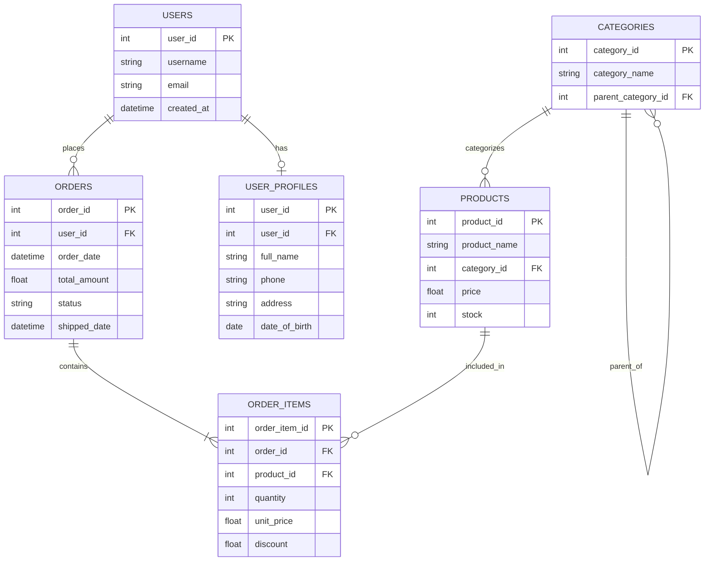

# TASK 02 — Đọc Schema như Đọc Business

> **Mục tiêu**: Nhìn bảng/cột/khóa là hiểu luồng nghiệp vụ; tránh join sai dẫn tới thống kê sai.

---

## 0. SCHEMA OVERVIEW — Nhìn toàn cảnh trước

### Entity Relationship Diagram (ERD)



**Đọc diagram:**
- `||--o{` = One to Many (1:N)
- `||--o|` = One to One (1:1)
- `||--|{` = One to Many (1:N, mandatory)
- PK = Primary Key
- FK = Foreign Key
- UK = Unique Key

---

## 1. THEORY — Nền tảng đọc schema

### 1.1. PK (Primary Key) - Định danh duy nhất
**Khái niệm**
- Mỗi bảng nên có PK để định danh duy nhất mỗi record
- PK không được NULL, không được trùng
- PK tự động tạo index (unique + clustered trong một số DB)

**Business meaning**
- `users.user_id` → mỗi user là 1 con người/tài khoản duy nhất
- `orders.order_id` → mỗi đơn hàng là 1 giao dịch riêng biệt
- `products.product_id` → mỗi sản phẩm là 1 SKU

**Câu hỏi tự kiểm tra**
- PK này có ý nghĩa nghiệp vụ gì?
- Có trường hợp nào 2 record có PK giống nhau không? → KHÔNG

---

### 1.2. FK (Foreign Key) - Mối quan hệ giữa các bảng
**Khái niệm**
- FK trong bảng A trỏ đến PK của bảng B
- FK giữ tính toàn vẹn dữ liệu (referential integrity)
- FK giúp hiểu luồng nghiệp vụ: "ai thuộc về ai"

**Business meaning**
```
orders.user_id → users.user_id
  → Đơn hàng thuộc về user nào?
  
order_items.order_id → orders.order_id
  → Chi tiết đơn hàng thuộc đơn nào?
  
order_items.product_id → products.product_id
  → Chi tiết đơn hàng mua sản phẩm gì?
```

**CASCADE behavior (quan trọng)**
- `ON DELETE CASCADE`: xóa parent → xóa luôn child (cẩn thận!)
- `ON DELETE RESTRICT`: không cho xóa parent nếu còn child
- `ON UPDATE CASCADE`: update PK parent → update luôn FK child

---

### 1.3. Cardinality - Số lượng quan hệ

#### **1:1 (One-to-One)**
```
users ←→ user_profiles
  user_id PK      user_id PK,FK
```
- Mỗi user có 1 profile, mỗi profile thuộc 1 user
- **Khi nào dùng**: tách bảng để tối ưu (bảng chính nhỏ, bảng profile có nhiều cột ít dùng)

#### **1:N (One-to-Many)** ← Phổ biến nhất
```
users ←→ orders
  user_id PK      order_id PK
                  user_id FK
```
- 1 user có nhiều orders
- 1 order chỉ thuộc 1 user
- **Business**: Khách hàng mua nhiều đơn hàng

#### **N:N (Many-to-Many)**
```
products ←→ order_items ←→ orders
  product_id      product_id FK     order_id
                  order_id FK
```
- 1 order có nhiều products
- 1 product có thể trong nhiều orders
- **Giải pháp**: Bảng trung gian (junction/bridge table) `order_items`

---

### 1.4. Fact Table vs Master Table (Dimension Table)

#### **Master/Dimension Table** (Bảng tra cứu)
- Lưu thông tin "gốc", ít thay đổi
- Thường có PK
- Ví dụ: `users`, `products`, `categories`, `countries`

**Đặc điểm**
```sql
-- users (Master)
user_id | username | email         | created_at
--------|----------|---------------|------------
1       | john     | john@mail.com | 2024-01-01
2       | alice    | alice@...     | 2024-01-02
```
- Ít row (hàng nghìn đến vài triệu)
- Nhiều được JOIN
- Ít INSERT/UPDATE

#### **Fact Table** (Bảng sự kiện)
- Lưu giao dịch, sự kiện, hành động
- Thường có nhiều FK trỏ đến Master
- Ví dụ: `orders`, `order_items`, `payments`, `logs`

**Đặc điểm**
```sql
-- orders (Fact)
order_id | user_id | order_date | total_amount | status
---------|---------|------------|--------------|--------
1001     | 1       | 2024-05-01 | 150.00       | paid
1002     | 2       | 2024-05-01 | 200.00       | pending
1003     | 1       | 2024-05-02 | 99.00        | paid
```
- Nhiều row (hàng triệu đến tỷ)
- Ít được JOIN như parent
- Nhiều INSERT, ít UPDATE

---

### 1.5. NULL Semantics - "Bẫy" lớn nhất của SQL

#### **NULL ≠ 0 ≠ '' (empty string)**
```sql
-- SAI
WHERE discount = NULL     -- sai, luôn false
WHERE discount != NULL    -- sai, luôn false

-- ĐÚNG
WHERE discount IS NULL
WHERE discount IS NOT NULL
```

#### **NULL trong tính toán**
```sql
SELECT 100 + NULL;        -- NULL
SELECT 100 * NULL;        -- NULL
SELECT 'Hello' || NULL;   -- NULL
```
→ **1 NULL làm hỏng cả phép tính**

#### **NULL trong COUNT**
```sql
SELECT COUNT(*) FROM orders;           -- đếm tất cả rows
SELECT COUNT(shipped_date) FROM orders; -- đếm rows có shipped_date NOT NULL
```

#### **NULL trong JOIN**
```sql
-- LEFT JOIN giữ NULL
SELECT u.username, o.order_id
FROM users u
LEFT JOIN orders o ON u.user_id = o.user_id;
-- User chưa đặt hàng → o.order_id = NULL
```

#### **NULL trong GROUP BY**
```sql
SELECT category, COUNT(*)
FROM products
GROUP BY category;
-- NULL category được group thành 1 nhóm riêng
```

---

### 1.6. Index Implications - Hiểu tác động của khóa lên performance

#### **PK tự động tạo Index**
```sql
-- PostgreSQL tự động tạo UNIQUE INDEX cho PK
CREATE TABLE users (
    user_id SERIAL PRIMARY KEY  -- Tự động tạo index
);

-- Equivalent to:
-- CREATE UNIQUE INDEX users_pkey ON users(user_id);
```
**Impact:**
- Query theo PK cực nhanh (O(log n))
- `WHERE user_id = 1` → Index Scan
- `ORDER BY user_id` → nhanh

#### **FK KHÔNG tự động tạo Index**
```sql
CREATE TABLE orders (
    order_id SERIAL PRIMARY KEY,
    user_id INTEGER,
    FOREIGN KEY (user_id) REFERENCES users(user_id)
);
-- FK được tạo, nhưng CHƯA có index trên orders.user_id!
```

**Problem:**
```sql
-- Query này CÓ THỂ chậm nếu orders lớn
SELECT * FROM orders WHERE user_id = 1;
-- → Sequential Scan (quét toàn bộ bảng)
```

**Solution:**
```sql
-- Tự tạo index cho FK
CREATE INDEX idx_orders_user_id ON orders(user_id);

-- Bây giờ query nhanh hơn
SELECT * FROM orders WHERE user_id = 1;
-- → Index Scan
```

#### **Best Practice: Luôn index FK**
```sql
-- Pattern chuẩn
CREATE TABLE order_items (
    order_item_id SERIAL PRIMARY KEY,
    order_id INTEGER NOT NULL,
    product_id INTEGER NOT NULL,
    FOREIGN KEY (order_id) REFERENCES orders(order_id),
    FOREIGN KEY (product_id) REFERENCES products(product_id)
);

-- Tạo index cho TẤT CẢ FK
CREATE INDEX idx_order_items_order_id ON order_items(order_id);
CREATE INDEX idx_order_items_product_id ON order_items(product_id);
```

**Khi nào cần Index FK?**
- ✅ Bảng lớn (>10k rows)
- ✅ Hay JOIN theo FK
- ✅ Hay WHERE theo FK
- ✅ Có ON DELETE CASCADE (cần index để xóa nhanh)
- ❌ Bảng nhỏ (<1k rows) và ít query

---

## 2. PRACTICE — Thực hành với PostgreSQL

### Setup Database

```sql
-- Tạo database mẫu
CREATE DATABASE ecommerce_practice;
\c ecommerce_practice;

-- 1. Master: Users
CREATE TABLE users (
    user_id SERIAL PRIMARY KEY,
    username VARCHAR(50) NOT NULL UNIQUE,
    email VARCHAR(100) NOT NULL UNIQUE,
    created_at TIMESTAMP DEFAULT CURRENT_TIMESTAMP
);

-- 2. Master: Categories
CREATE TABLE categories (
    category_id SERIAL PRIMARY KEY,
    category_name VARCHAR(50) NOT NULL,
    parent_category_id INTEGER,
    FOREIGN KEY (parent_category_id) REFERENCES categories(category_id)
);

-- 3. Master: Products
CREATE TABLE products (
    product_id SERIAL PRIMARY KEY,
    product_name VARCHAR(100) NOT NULL,
    category_id INTEGER,
    price DECIMAL(10,2) NOT NULL,
    stock INTEGER DEFAULT 0,
    FOREIGN KEY (category_id) REFERENCES categories(category_id)
);

-- 4. Fact: Orders
CREATE TABLE orders (
    order_id SERIAL PRIMARY KEY,
    user_id INTEGER NOT NULL,
    order_date TIMESTAMP DEFAULT CURRENT_TIMESTAMP,
    total_amount DECIMAL(10,2),
    status VARCHAR(20) DEFAULT 'pending',
    shipped_date TIMESTAMP NULL,  -- Chú ý: NULL
    FOREIGN KEY (user_id) REFERENCES users(user_id)
);

-- 5. Fact: Order Items (N:N junction)
CREATE TABLE order_items (
    order_item_id SERIAL PRIMARY KEY,
    order_id INTEGER NOT NULL,
    product_id INTEGER NOT NULL,
    quantity INTEGER NOT NULL DEFAULT 1,
    unit_price DECIMAL(10,2) NOT NULL,
    discount DECIMAL(10,2) NULL,  -- Chú ý: NULL
    FOREIGN KEY (order_id) REFERENCES orders(order_id) ON DELETE CASCADE,
    FOREIGN KEY (product_id) REFERENCES products(product_id)
);

-- 6. 1:1 User Profiles
CREATE TABLE user_profiles (
    user_id INTEGER PRIMARY KEY,
    full_name VARCHAR(100),
    phone VARCHAR(20),
    address TEXT,
    date_of_birth DATE,
    FOREIGN KEY (user_id) REFERENCES users(user_id) ON DELETE CASCADE
);

-- Insert sample data
INSERT INTO users (username, email) VALUES
('john_doe', 'john@example.com'),
('alice_wonder', 'alice@example.com'),
('bob_builder', 'bob@example.com'),
('charlie_brown', 'charlie@example.com');

INSERT INTO categories (category_name, parent_category_id) VALUES
('Electronics', NULL),
('Phones', 1),
('Laptops', 1),
('Clothing', NULL),
('Men', 4),
('Women', 4);

INSERT INTO products (product_name, category_id, price, stock) VALUES
('iPhone 15', 2, 999.99, 50),
('Samsung Galaxy S24', 2, 899.99, 30),
('MacBook Pro', 3, 2499.99, 20),
('Dell XPS 13', 3, 1299.99, 15),
('T-Shirt', 5, 29.99, 100),
('Jeans', 5, 79.99, 50),
('Dress', 6, 99.99, 40),
('Headphones', 1, 199.99, NULL);  -- NULL stock

INSERT INTO orders (user_id, order_date, status, shipped_date) VALUES
(1, '2024-01-15', 'delivered', '2024-01-16'),
(1, '2024-02-20', 'delivered', '2024-02-21'),
(2, '2024-03-10', 'pending', NULL),  -- chưa ship
(3, '2024-03-15', 'shipped', '2024-03-16'),
(4, '2024-03-20', 'cancelled', NULL);

INSERT INTO order_items (order_id, product_id, quantity, unit_price, discount) VALUES
(1, 1, 1, 999.99, NULL),
(1, 8, 1, 199.99, 20.00),  -- có discount
(2, 3, 1, 2499.99, NULL),
(3, 5, 2, 29.99, NULL),
(3, 6, 1, 79.99, 10.00),   -- có discount
(4, 2, 1, 899.99, NULL);

INSERT INTO user_profiles (user_id, full_name, phone) VALUES
(1, 'John Doe', '555-0101'),
(2, 'Alice Wonder', '555-0102');
-- Chú ý: user 3, 4 không có profile (1:1 optional)
```

---

## 3. BÀI TẬP THỰC HÀNH

### **Exercise 1: Phân biệt Master vs Fact**

**Câu hỏi:**
1. Những bảng nào là Master? Tại sao?
2. Những bảng nào là Fact? Tại sao?
3. Bảng nào có xu hướng tăng row nhanh nhất?

<details>
<summary>Đáp án</summary>

**Master:** users, categories, products, user_profiles
- Lưu thông tin gốc, ít thay đổi
- Được JOIN nhiều

**Fact:** orders, order_items
- Lưu giao dịch, sự kiện
- Row tăng liên tục theo thời gian

**Tăng nhanh nhất:** order_items (mỗi đơn hàng có nhiều items)
</details>

---

### **Exercise 2: Xác định Cardinality**

**Câu hỏi:** Xác định quan hệ giữa các bảng:
1. users ↔ orders
2. orders ↔ order_items
3. products ↔ order_items
4. users ↔ user_profiles
5. categories ↔ categories (self-reference)

<details>
<summary>Đáp án</summary>

1. **users ↔ orders**: 1:N (1 user nhiều orders)
2. **orders ↔ order_items**: 1:N (1 order nhiều items)
3. **products ↔ order_items**: N:N qua order_items (1 product trong nhiều orders, 1 order nhiều products)
4. **users ↔ user_profiles**: 1:1 (optional)
5. **categories ↔ categories**: 1:N (parent-child hierarchy)
</details>

---

### **Exercise 3: NULL Hunting - Tìm và hiểu NULL**

```sql
-- Q1: Có bao nhiêu products chưa có category?
SELECT COUNT(*) FROM products WHERE category_id IS NULL;

-- Q2: Có bao nhiêu products có stock = NULL?
SELECT COUNT(*) FROM products WHERE stock IS NULL;

-- Q3: Có bao nhiêu orders chưa shipped (shipped_date = NULL)?
SELECT COUNT(*) FROM orders WHERE shipped_date IS NULL;

-- Q4: Có bao nhiêu order_items không có discount?
SELECT COUNT(*) FROM order_items WHERE discount IS NULL;

-- Q5: Tính tổng discount (chú ý NULL!)
-- Cách SAI:
SELECT SUM(discount) FROM order_items;  -- NULL bị bỏ qua, kết quả = 30

-- Cách ĐÚNG (convert NULL → 0):
SELECT SUM(COALESCE(discount, 0)) FROM order_items;
```

**Bài tập:**
1. Tìm tất cả users KHÔNG có profile
2. Tìm tất cả products có stock NULL hoặc = 0
3. Tính tổng discount, count bao nhiêu items có discount

<details>
<summary>Đáp án</summary>

```sql
-- 1. Users không có profile
SELECT u.user_id, u.username
FROM users u
LEFT JOIN user_profiles up ON u.user_id = up.user_id
WHERE up.user_id IS NULL;

-- 2. Products có stock NULL hoặc 0
SELECT product_id, product_name, stock
FROM products
WHERE stock IS NULL OR stock = 0;

-- 3. Tổng discount và count
SELECT 
    SUM(COALESCE(discount, 0)) as total_discount,
    COUNT(discount) as items_with_discount,  -- chỉ đếm NOT NULL
    COUNT(*) as total_items
FROM order_items;
```
</details>

---

### **Exercise 4: Đọc schema để trả lời business**

**Bước 1: Không viết query, chỉ dựa vào schema để trả lời:**

1. Làm sao biết 1 user đã đặt bao nhiêu đơn hàng?
2. Làm sao biết 1 sản phẩm được bán bao nhiêu lần?
3. Làm sao biết tổng doanh thu của 1 đơn hàng?
4. Làm sao tìm tất cả đơn hàng của user "john_doe"?
5. Làm sao tìm category cha của "Phones"?

<details>
<summary>Đáp án phân tích</summary>

1. **COUNT orders theo user_id:** `orders.user_id → users.user_id`
2. **COUNT order_items theo product_id:** `order_items.product_id → products.product_id`
3. **SUM từ order_items:** `order_items.order_id → orders.order_id`, sum (quantity * unit_price - discount)
4. **JOIN users → orders:** WHERE users.username = 'john_doe'
5. **Self-join categories:** `categories.parent_category_id → categories.category_id` WHERE category_name = 'Phones'
</details>

**Bước 2: Viết queries để verify:**

<details>
<summary>Queries solution</summary>

```sql
-- 1. User đã đặt bao nhiêu đơn hàng?
SELECT 
    u.username,
    COUNT(o.order_id) as total_orders
FROM users u
LEFT JOIN orders o ON u.user_id = o.user_id
GROUP BY u.user_id, u.username
ORDER BY total_orders DESC;

-- 2. Sản phẩm được bán bao nhiêu lần?
SELECT 
    p.product_name,
    COUNT(oi.order_item_id) as times_sold,
    SUM(oi.quantity) as total_quantity_sold
FROM products p
LEFT JOIN order_items oi ON p.product_id = oi.product_id
GROUP BY p.product_id, p.product_name
ORDER BY times_sold DESC;

-- 3. Tổng doanh thu của đơn hàng (calculated vs stored)
SELECT 
    o.order_id,
    o.total_amount as stored_total,
    SUM(oi.quantity * oi.unit_price - COALESCE(oi.discount, 0)) as calculated_total
FROM orders o
LEFT JOIN order_items oi ON o.order_id = oi.order_id
GROUP BY o.order_id, o.total_amount;

-- 4. Tất cả đơn hàng của user "john_doe"
SELECT 
    o.order_id,
    o.order_date,
    o.status,
    o.total_amount
FROM users u
INNER JOIN orders o ON u.user_id = o.user_id
WHERE u.username = 'john_doe'
ORDER BY o.order_date DESC;

-- 5. Category cha của "Phones"
SELECT 
    child.category_name as child_category,
    parent.category_name as parent_category
FROM categories child
LEFT JOIN categories parent ON child.parent_category_id = parent.category_id
WHERE child.category_name = 'Phones';
```
</details>

---

### **Exercise 5: Phát hiện lỗi thiết kế**

**Câu hỏi:** Schema hiện tại có vấn đề gì?

```sql
-- Vấn đề 1: orders.total_amount có thể sai lệch
-- total_amount được lưu nhưng có thể không = tổng order_items
-- → Denormalization risk

-- Vấn đề 2: products.stock không giảm khi order
-- → Cần trigger hoặc app logic

-- Vấn đề 3: order_items.unit_price
-- Tại sao không dùng products.price?
-- → Đúng! Giá sản phẩm có thể thay đổi, cần lưu giá tại thời điểm mua
```

**Bài tập:** Viết query kiểm tra orders có total_amount đúng không

<details>
<summary>Đáp án</summary>

```sql
SELECT 
    o.order_id,
    o.total_amount as stored_total,
    SUM(oi.quantity * oi.unit_price - COALESCE(oi.discount, 0)) as calculated_total,
    o.total_amount - SUM(oi.quantity * oi.unit_price - COALESCE(oi.discount, 0)) as difference
FROM orders o
LEFT JOIN order_items oi ON o.order_id = oi.order_id
GROUP BY o.order_id, o.total_amount
HAVING o.total_amount IS NOT NULL 
   AND ABS(o.total_amount - SUM(oi.quantity * oi.unit_price - COALESCE(oi.discount, 0))) > 0.01;
```
</details>

---

### **Exercise 6: CASCADE behavior**

```sql
-- Test ON DELETE CASCADE
-- Xóa order sẽ xóa luôn order_items?

-- Kiểm tra trước khi xóa
SELECT * FROM orders WHERE order_id = 4;
SELECT * FROM order_items WHERE order_id = 4;

-- Xóa order
DELETE FROM orders WHERE order_id = 4;

-- Kiểm tra sau khi xóa
SELECT * FROM order_items WHERE order_id = 4;  -- Nên = 0 rows

-- Test ON DELETE RESTRICT
-- Thử xóa user có orders → sẽ bị lỗi
DELETE FROM users WHERE user_id = 1;  
-- ERROR: violates foreign key constraint
```

**Câu hỏi:**
1. Tại sao orders → order_items dùng CASCADE?
2. Tại sao users → orders KHÔNG dùng CASCADE?

<details>
<summary>Đáp án</summary>

1. **CASCADE hợp lý:** Xóa đơn hàng → xóa luôn chi tiết đơn hàng (business logic đúng)
2. **KHÔNG CASCADE:** Xóa user KHÔNG nên xóa đơn hàng (cần giữ lịch sử giao dịch). Nên dùng soft delete cho users.
</details>

---

### **Exercise 7: Real-world Scenarios**

#### **Scenario A: Soft Delete Pattern**

**Problem:** Không muốn xóa user thật (phải giữ lịch sử), nhưng cần "vô hiệu hóa" user.

**Solution: Thêm cột deleted_at**
```sql
-- Sửa bảng users
ALTER TABLE users ADD COLUMN deleted_at TIMESTAMP NULL;
ALTER TABLE users ADD COLUMN is_active BOOLEAN DEFAULT TRUE;

-- "Xóa" user (soft delete)
UPDATE users 
SET deleted_at = CURRENT_TIMESTAMP, is_active = FALSE
WHERE user_id = 1;

-- Query chỉ lấy user active
SELECT * FROM users WHERE deleted_at IS NULL;
-- hoặc
SELECT * FROM users WHERE is_active = TRUE;

-- Restore user
UPDATE users 
SET deleted_at = NULL, is_active = TRUE
WHERE user_id = 1;
```

**Best Practice:**
- Luôn thêm WHERE deleted_at IS NULL trong queries
- Tạo view để tự động filter
```sql
CREATE VIEW active_users AS
SELECT * FROM users WHERE deleted_at IS NULL;

-- Dùng view thay vì bảng gốc
SELECT * FROM active_users;
```

#### **Scenario B: Audit Columns Pattern**

**Problem:** Cần biết ai tạo, ai sửa, khi nào?

**Solution: Thêm audit columns**
```sql
-- Pattern chuẩn cho mọi bảng
CREATE TABLE products (
    product_id SERIAL PRIMARY KEY,
    product_name VARCHAR(100) NOT NULL,
    price DECIMAL(10,2) NOT NULL,
    
    -- Audit columns
    created_at TIMESTAMP DEFAULT CURRENT_TIMESTAMP,
    created_by INTEGER REFERENCES users(user_id),
    updated_at TIMESTAMP DEFAULT CURRENT_TIMESTAMP,
    updated_by INTEGER REFERENCES users(user_id),
    deleted_at TIMESTAMP NULL,
    deleted_by INTEGER REFERENCES users(user_id)
);

-- Trigger tự động update updated_at
CREATE OR REPLACE FUNCTION update_timestamp()
RETURNS TRIGGER AS $$
BEGIN
    NEW.updated_at = CURRENT_TIMESTAMP;
    RETURN NEW;
END;
$$ LANGUAGE plpgsql;

CREATE TRIGGER set_updated_at
BEFORE UPDATE ON products
FOR EACH ROW
EXECUTE FUNCTION update_timestamp();
```

**Lợi ích:**
- Truy vết được mọi thay đổi
- Debug dễ hơn
- Compliance với audit requirements

#### **Scenario C: Versioning Pattern**

**Problem:** Cần lưu lịch sử thay đổi giá sản phẩm.

**Solution: Bảng history**
```sql
-- Bảng chính
CREATE TABLE products (
    product_id SERIAL PRIMARY KEY,
    product_name VARCHAR(100),
    current_price DECIMAL(10,2)
);

-- Bảng lịch sử giá
CREATE TABLE product_price_history (
    history_id SERIAL PRIMARY KEY,
    product_id INTEGER REFERENCES products(product_id),
    old_price DECIMAL(10,2),
    new_price DECIMAL(10,2),
    changed_at TIMESTAMP DEFAULT CURRENT_TIMESTAMP,
    changed_by INTEGER REFERENCES users(user_id)
);

-- Trigger tự động log thay đổi giá
CREATE OR REPLACE FUNCTION log_price_change()
RETURNS TRIGGER AS $$
BEGIN
    IF OLD.current_price != NEW.current_price THEN
        INSERT INTO product_price_history (product_id, old_price, new_price)
        VALUES (NEW.product_id, OLD.current_price, NEW.current_price);
    END IF;
    RETURN NEW;
END;
$$ LANGUAGE plpgsql;

CREATE TRIGGER track_price_changes
AFTER UPDATE ON products
FOR EACH ROW
EXECUTE FUNCTION log_price_change();
```

---

## 4. COMMON MISTAKES — Lỗi thường gặp

### ❌ Mistake 1: Quên NULL trong tính toán
```sql
-- SAI: discount NULL làm hỏng tổng
SELECT 
    order_id,
    SUM(quantity * unit_price - discount) as total  -- SAI!
FROM order_items
GROUP BY order_id;

-- ĐÚNG: COALESCE NULL thành 0
SELECT 
    order_id,
    SUM(quantity * unit_price - COALESCE(discount, 0)) as total
FROM order_items
GROUP BY order_id;
```

### ❌ Mistake 2: JOIN sai dẫn data explosion
```sql
-- Problem: 1 user có 2 orders, mỗi order có 3 items
-- → 2 * 3 = 6 rows, nhưng COUNT(*) = 6, không phải 2!

SELECT 
    u.username,
    COUNT(*) as order_count  -- SAI! = 6 thay vì 2
FROM users u
INNER JOIN orders o ON u.user_id = o.user_id
INNER JOIN order_items oi ON o.order_id = oi.order_id
GROUP BY u.username;

-- ĐÚNG: COUNT DISTINCT
SELECT 
    u.username,
    COUNT(DISTINCT o.order_id) as order_count  -- ĐÚNG = 2
FROM users u
INNER JOIN orders o ON u.user_id = o.user_id
INNER JOIN order_items oi ON o.order_id = oi.order_id
GROUP BY u.username;

-- HOẶC: Không JOIN thừa
SELECT 
    u.username,
    COUNT(o.order_id) as order_count
FROM users u
LEFT JOIN orders o ON u.user_id = o.user_id
GROUP BY u.username;
```

### ❌ Mistake 3: Không hiểu LEFT vs INNER JOIN với NULL
```sql
-- Data:
-- users: id=1,2,3
-- orders: user_id=1,1,2 (user 3 chưa order)

-- INNER JOIN: Chỉ lấy user có orders
SELECT u.username, COUNT(o.order_id)
FROM users u
INNER JOIN orders o ON u.user_id = o.user_id
GROUP BY u.username;
-- Result: john=2, alice=1 (thiếu bob!)

-- LEFT JOIN: Lấy tất cả users
SELECT u.username, COUNT(o.order_id)
FROM users u
LEFT JOIN orders o ON u.user_id = o.user_id
GROUP BY u.username;
-- Result: john=2, alice=1, bob=0 (đúng!)
```

### ❌ Mistake 4: Quên index FK
```sql
-- Tạo FK nhưng quên index
CREATE TABLE orders (
    order_id SERIAL PRIMARY KEY,
    user_id INTEGER,
    FOREIGN KEY (user_id) REFERENCES users(user_id)
);
-- → Query WHERE user_id = X sẽ CHẬM!

-- ĐÚNG: Luôn index FK
CREATE INDEX idx_orders_user_id ON orders(user_id);
```

### ❌ Mistake 5: Denormalization không đồng bộ
```sql
-- orders.total_amount là denormalized field
-- Nhưng không update khi order_items thay đổi!

-- SAI: Insert order_items nhưng không update orders.total_amount
INSERT INTO order_items (order_id, product_id, quantity, unit_price)
VALUES (1, 5, 2, 29.99);
-- orders.total_amount vẫn cũ → SAI!

-- ĐÚNG: Dùng trigger hoặc transaction
BEGIN;
    INSERT INTO order_items ...;
    UPDATE orders 
    SET total_amount = (
        SELECT SUM(quantity * unit_price - COALESCE(discount, 0))
        FROM order_items
        WHERE order_id = 1
    )
    WHERE order_id = 1;
COMMIT;
```

---

## 5. BEST PRACTICES — Quy tắc vàng

### ✅ Practice 1: NULL Design Decision

**Khi nào cho phép NULL?**
- ✅ Optional information: `phone`, `middle_name`, `shipped_date`
- ✅ Future data: `completed_at`, `cancelled_at`
- ✅ Conditional fields: `discount` (không phải lúc nào cũng có)

**Khi nào KHÔNG cho phép NULL?**
- ❌ Business identifiers: `email`, `username`, `order_id`
- ❌ Audit fields: `created_at`, `created_by`
- ❌ Foreign keys (nếu relationship là mandatory)

```sql
-- Good design
CREATE TABLE orders (
    order_id SERIAL PRIMARY KEY,
    user_id INTEGER NOT NULL,              -- FK mandatory
    order_date TIMESTAMP NOT NULL,         -- Luôn cần
    shipped_date TIMESTAMP NULL,           -- Optional (chưa ship)
    notes TEXT NULL,                       -- Optional
    FOREIGN KEY (user_id) REFERENCES users(user_id)
);
```

### ✅ Practice 2: Naming Conventions

```sql
-- ✅ GOOD: Consistent, clear
users.user_id
orders.user_id        -- FK giống tên PK
order_items.order_id

-- ❌ BAD: Inconsistent
users.id
orders.userId         -- camelCase không chuẩn SQL
order_items.orderId
```

**Quy tắc:**
- Table: `lowercase_plural` → `users`, `order_items`
- Column: `lowercase_underscore` → `user_id`, `created_at`
- PK: `{table_name}_id` → `user_id`, `order_id`
- FK: Giống tên PK mà nó tham chiếu
- Boolean: `is_active`, `has_shipped`, `can_edit`

### ✅ Practice 3: Composite Keys khi nào cần?

```sql
-- Scenario: 1 user chỉ có 1 active cart
CREATE TABLE shopping_carts (
    user_id INTEGER NOT NULL,
    session_id VARCHAR(100) NOT NULL,
    created_at TIMESTAMP DEFAULT CURRENT_TIMESTAMP,
    PRIMARY KEY (user_id, session_id),  -- Composite PK
    FOREIGN KEY (user_id) REFERENCES users(user_id)
);

-- Hoặc: Unique constraint
CREATE TABLE user_settings (
    setting_id SERIAL PRIMARY KEY,
    user_id INTEGER NOT NULL,
    setting_key VARCHAR(50) NOT NULL,
    setting_value TEXT,
    UNIQUE (user_id, setting_key),  -- 1 user, 1 key chỉ 1 giá trị
    FOREIGN KEY (user_id) REFERENCES users(user_id)
);
```

### ✅ Practice 4: Always have timestamps

```sql
-- Minimum audit columns cho MỌI bảng
CREATE TABLE any_table (
    id SERIAL PRIMARY KEY,
    -- ... business columns ...
    
    created_at TIMESTAMP DEFAULT CURRENT_TIMESTAMP,
    updated_at TIMESTAMP DEFAULT CURRENT_TIMESTAMP
);
```

### ✅ Practice 5: Document your schema

```sql
-- Dùng COMMENT để giải thích
COMMENT ON TABLE orders IS 'Customer orders with payment and shipping info';
COMMENT ON COLUMN orders.status IS 'Values: pending, paid, shipped, delivered, cancelled';
COMMENT ON COLUMN orders.total_amount IS 'Denormalized field - sum of order_items. Updated via trigger.';
```

---

## 6. CHECKLIST ĐẠT TASK 02

✅ **Hiểu PK/FK:**
- [ ] Biết PK là gì, tại sao cần PK
- [ ] Biết FK là gì, đọc FK là hiểu luồng business
- [ ] Hiểu CASCADE behavior (DELETE, UPDATE)
- [ ] Biết PK tự động index, FK KHÔNG tự động index

✅ **Phân biệt Cardinality:**
- [ ] Nhận diện 1:1, 1:N, N:N chỉ bằng nhìn schema
- [ ] Biết N:N cần bảng trung gian
- [ ] Đọc được ERD diagram

✅ **Master vs Fact:**
- [ ] Phân biệt được bảng nào là Master, bảng nào là Fact
- [ ] Hiểu Fact table có xu hướng lớn nhanh

✅ **NULL Semantics:**
- [ ] NULL ≠ 0 ≠ ''
- [ ] Dùng IS NULL, không dùng = NULL
- [ ] Hiểu NULL trong COUNT, SUM, JOIN
- [ ] Luôn dùng COALESCE khi tính toán với NULL

✅ **Index implications:**
- [ ] Biết khi nào cần index FK
- [ ] Hiểu tác động của index lên performance

✅ **Đọc schema trả lời business:**
- [ ] Nhìn schema biết query nào cần JOIN nào
- [ ] Nhận diện được lỗi thiết kế tiềm năng
- [ ] Tránh được data explosion khi JOIN

✅ **Best Practices:**
- [ ] Biết khi nào cho phép NULL, khi nào không
- [ ] Áp dụng naming conventions nhất quán
- [ ] Hiểu soft delete và audit columns pattern
- [ ] Document schema bằng COMMENT

✅ **Common Mistakes:**
- [ ] Tránh quên COALESCE với NULL
- [ ] Tránh data explosion khi JOIN nhiều bảng
- [ ] Hiểu LEFT vs INNER JOIN với NULL
- [ ] Không quên index FK

---

## 7. NEXT STEP

Sau khi hoàn thành Task 02, bạn đã:
- Hiểu cấu trúc dữ liệu như hiểu nghiệp vụ
- Sẵn sàng viết query JOIN đúng (Task 07, 08)
- Tránh được lỗi sai logic do hiểu sai schema
- Nắm vững best practices và tránh được common mistakes
- Có thể áp dụng real-world patterns (soft delete, audit, versioning)

**→ Tiếp theo: TASK 03 — SELECT tối thiểu, đúng thứ cần**

---

## 📚 TÀI LIỆU THAM KHẢO

- [PostgreSQL Foreign Keys](https://www.postgresql.org/docs/current/ddl-constraints.html#DDL-CONSTRAINTS-FK)
- [Database Normalization](https://en.wikipedia.org/wiki/Database_normalization)
- [ERD Best Practices](https://vertabelo.com/blog/entity-relationship-diagram/)
- [SQL NULL Handling](https://modern-sql.com/concept/null)
